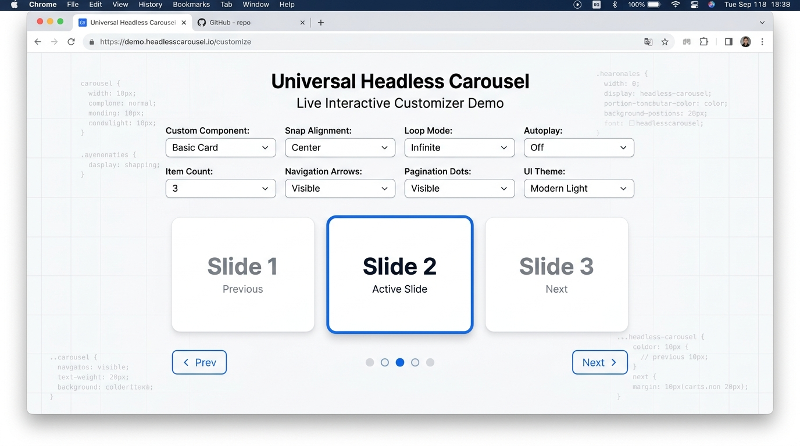
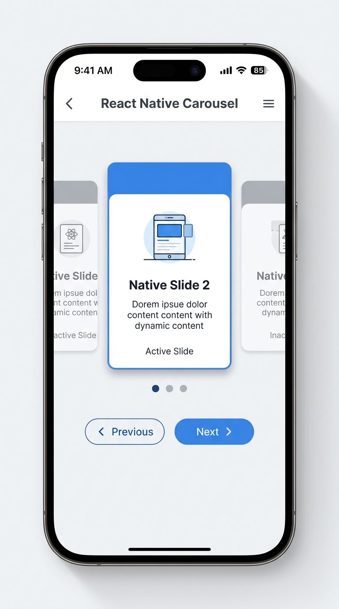

# universal-headless-carousel 🎠

[](https://github.com/harshmetrey/universal-headless-carousel/actions)
[](https://opensource.org/licenses/MIT)

A headless, cross-platform (React & React Native) carousel npm package built with TypeScript, CSS Scroll Snap, and native `FlatList` physics. Zero forced UI, 100% style customization, and production-grade accessibility (A11y).

---

## 🎨 Visual Previews

### 🌐 Web Carousel (CSS Scroll Snap Engine)


### 📱 React Native Carousel (`FlatList` Engine)


---

## 📦 Packages

| Package | Version | Description |
| :--- | :--- | :--- |
| [`@universal-headless-carousel/core`](./packages/core) | `1.0.0` | Framework-agnostic state machine & math engine |
| [`@universal-headless-carousel/web`](./packages/web) | `1.0.0` | Web engine utilizing hardware-accelerated CSS Scroll Snap |
| [`@universal-headless-carousel/native`](./packages/native) | `1.0.0` | React Native engine using native `FlatList` & viewability sync |

---

## 🚀 Installation

### Web (React)
```bash
# npm
npm install @universal-headless-carousel/web

# pnpm
pnpm add @universal-headless-carousel/web
```

### React Native
```bash
# npm
npm install @universal-headless-carousel/native @universal-headless-carousel/core

# pnpm
pnpm add @universal-headless-carousel/native @universal-headless-carousel/core
```

---

## 💡 Quick Start

### 🌐 1. Web Example (`@universal-headless-carousel/web`)

```tsx
import React from 'react';
import { useWebCarousel } from '@universal-headless-carousel/web';

const items = ['Slide 1', 'Slide 2', 'Slide 3', 'Slide 4'];

export function WebCarouselExample() {
  const {
    activeIndex,
    next,
    prev,
    goTo,
    isFirst,
    isLast,
    isPlaying,
    play,
    pause,
    getContainerProps,
    getItemProps
  } = useWebCarousel({
    itemsCount: items.length,
    loop: true,
    autoplay: 3000,
    snapAlign: 'center'
  });

  return (
    <div style={{ maxWidth: 600, margin: '0 auto' }}>
      {/* Scroll Snap Container */}
      <div
        {...getContainerProps({
          style: { gap: '1rem', padding: '1rem' }
        })}
      >
        {items.map((item, index) => (
          <div
            key={index}
            {...getItemProps(index, {
              style: {
                width: '80%',
                height: 200,
                backgroundColor: index === activeIndex ? '#3b82f6' : '#e5e7eb',
                color: index === activeIndex ? '#fff' : '#1f2937',
                borderRadius: 12,
                display: 'flex',
                alignItems: 'center',
                justifyContent: 'center',
                fontSize: '1.5rem',
                fontWeight: 'bold',
                transition: 'background-color 0.3s ease'
              }
            })}
          >
            {item}
          </div>
        ))}
      </div>

      {/* Controls & Pagination */}
      <div style={{ display: 'flex', justifyContent: 'space-between', marginTop: '1rem' }}>
        <button onClick={prev}>Previous</button>
        <div>
          {items.map((_, index) => (
            <button
              key={index}
              onClick={() => goTo(index)}
              style={{
                fontWeight: index === activeIndex ? 'bold' : 'normal',
                margin: '0 4px'
              }}
            >
              {index + 1}
            </button>
          ))}
        </div>
        <button onClick={next}>Next</button>
      </div>
    </div>
  );
}
```

---

### 📱 2. React Native Example (`@universal-headless-carousel/native`)

```tsx
import React from 'react';
import { View, Text, FlatList, TouchableOpacity, Dimensions } from 'react-native';
import { useNativeCarousel } from '@universal-headless-carousel/native';

const { width: WINDOW_WIDTH } = Dimensions.get('window');
const ITEM_WIDTH = WINDOW_WIDTH * 0.8;

const items = ['Native Slide 1', 'Native Slide 2', 'Native Slide 3'];

export function NativeCarouselExample() {
  const {
    activeIndex,
    flatListRef,
    next,
    prev,
    goTo,
    getFlatListProps,
    getItemProps
  } = useNativeCarousel({
    itemsCount: items.length,
    itemWidth: ITEM_WIDTH,
    loop: true
  });

  return (
    <View style={{ flex: 1, alignItems: 'center', justifyContent: 'center' }}>
      <FlatList
        ref={flatListRef}
        data={items}
        keyExtractor={(_, index) => index.toString()}
        renderItem={({ item, index }) => (
          <View
            {...getItemProps(index)}
            style={{
              width: ITEM_WIDTH,
              height: 200,
              backgroundColor: index === activeIndex ? '#10b981' : '#d1d5db',
              borderRadius: 16,
              alignItems: 'center',
              justifyContent: 'center',
              marginHorizontal: (WINDOW_WIDTH - ITEM_WIDTH) / 2
            }}
          >
            <Text style={{ fontSize: 20, color: '#fff', fontWeight: 'bold' }}>{item}</Text>
          </View>
        )}
        {...getFlatListProps()}
      />

      <View style={{ flexDirection: 'row', marginTop: 16 }}>
        <TouchableOpacity onPress={prev} style={{ padding: 10 }}>
          <Text>Prev</Text>
        </TouchableOpacity>
        <TouchableOpacity onPress={next} style={{ padding: 10 }}>
          <Text>Next</Text>
        </TouchableOpacity>
      </View>
    </View>
  );
}
```

---

## ♿️ Accessibility (A11y)

Both `@universal-headless-carousel/web` and `@universal-headless-carousel/native` auto-inject compliant WAI-ARIA Attributes:
- **Container**: `role="region"`, `aria-roledescription="carousel"`, `aria-label="Carousel"`.
- **Keyboard Navigation**:
  - `ArrowLeft`: Navigate to previous slide.
  - `ArrowRight`: Navigate to next slide.
  - `Home`: Navigate to first slide.
  - `End`: Navigate to last slide.
- **Auto-Pause on Hover**: Pauses autoplay on `mouseenter` and resumes on `mouseleave`.
- **Items**: `role="group"`, `aria-roledescription="slide"`, `aria-label="Slide X of Y"`, `aria-hidden={!isActive}`.

---

## 🛠 License

Distributed under the MIT License. See [LICENSE](./LICENSE) for details.
